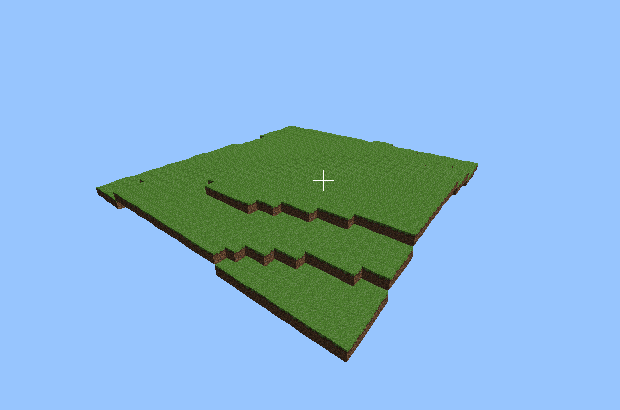

# PyCraft
_Minecraft written in PyGame. Because why not._

## Usage
`python3 main.py` to run the game.  
`python3 test.py` to run unit tests.  

## Controls
| Key  | Action |
|------|--------|
|`WASD`|Movement|
|Mouse |Rotate camera|
|`ESC` |Free/grab cursor|

## Notes
* It's slow. Such is the way of loops in Python.
* On my machine runs at 8FPS with 4 blocks, and at 3FPS with 64 blocks.
* Drawing could be sped up using Numpy vectorization, but drawing textured triangles with that would be rather difficult to figure out.
* The closer you get to blocks, the slower it will be. You may need to hold down `ESC` longer to free the cursor.

32x32 map I managed to render:  

Thank you to [Javidx9](https://github.com/OneLoneCoder/)'s 3D renderer tutorials. A portion of the matrix code was derived from his.  
Media from [Hugues Alexandre Ross](https://huguesross.net)' [RPG16 texturepack](https://content.minetest.net/packages/Hugues%20Ross/rpg16/), licensed under the [Creative Commons Attribution-ShareAlike 4.0 International License](https://creativecommons.org/licenses/by-sa/4.0/).  
